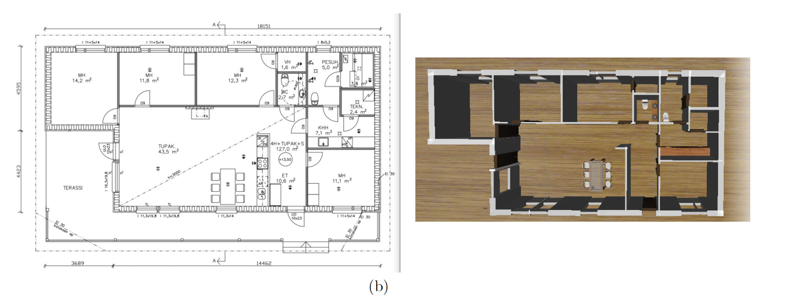
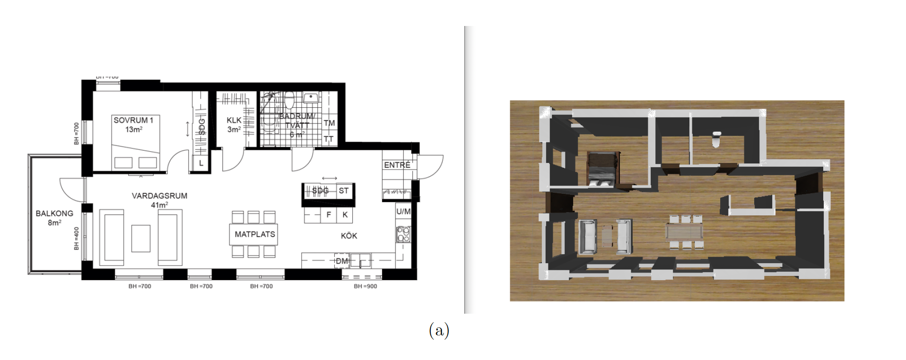
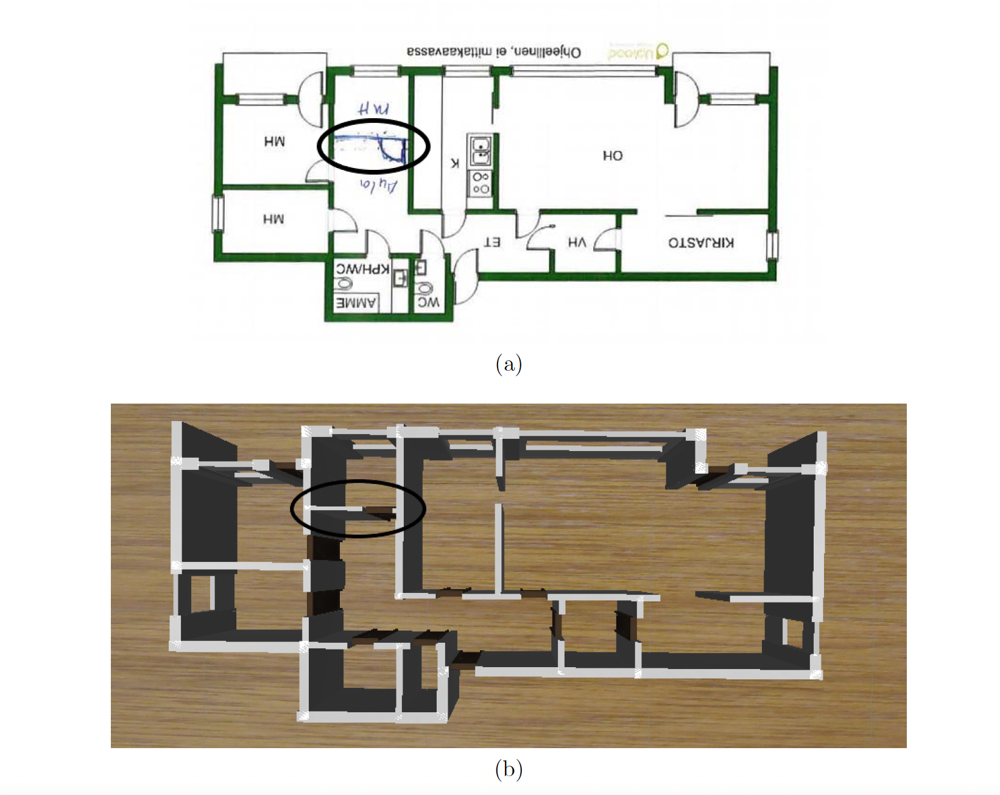
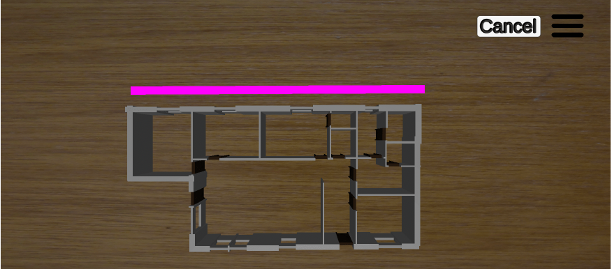
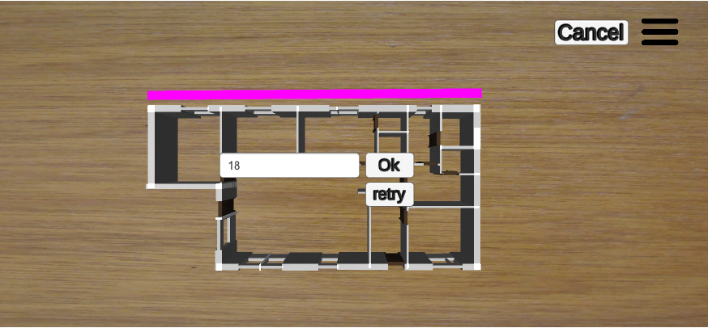
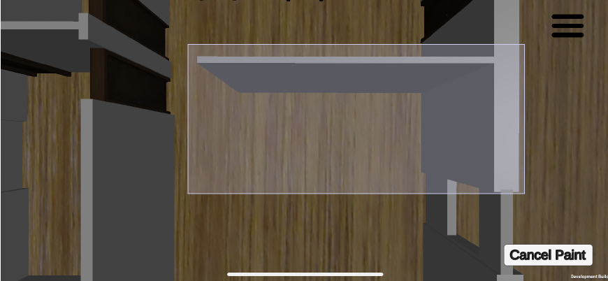
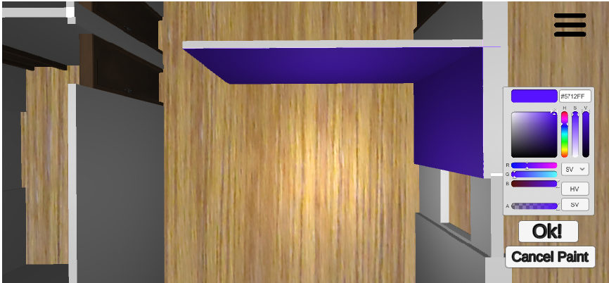
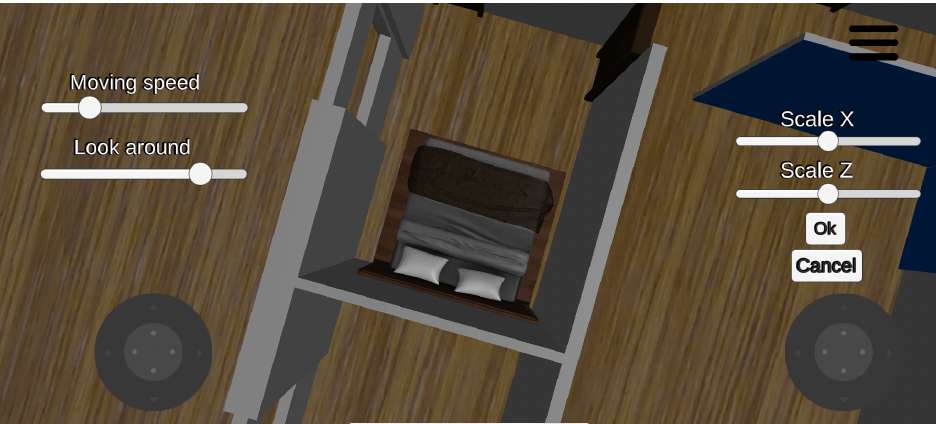

# FloorPlanTo3D: The Next Dimension in Architectural Visualization

## Introduction

FloorPlanTo3D introduces an innovative approach to transform 2D floor plan images into customizable 3D models. The process begins with users selecting a floor plan image, which is then sent to a deep learning model for analysis. Subsequently, users have the ability to customize the generated 3D scene according to their preferences.
  

FloorPlanTo3D showcases the robust capability to detect and interpret floor plans with different drawing styles, including those with hand-drawn elements.

## Project Components

FloorPlanTo3D is structured into two main parts:

1.  **Mask R-CNN Model Wrapped by REST API**: A sophisticated deep learning model that analyzes and interprets 2D floor plan images.

2.  **Unity Application**: A dynamic application that utilizes the API to construct a 3D scene from the analyzed 2D floor plan images, enabling users to customize their virtual environment.

## Enhanced Features and Improvements

This repository has been significantly enhanced with advanced analysis capabilities and new endpoints for comprehensive floor plan interpretation:

### New API Endpoints

**Enhanced Analysis Endpoint (`/`)**
- Provides comprehensive JSON structure with detailed semantic data
- Includes object dimensions, confidence scores, and center coordinates
- Enhanced metadata with timestamp and image dimensions
- Automatic file generation with simple naming convention (`plan{N}.json`)

**Visualization Endpoint (`/visualize`)**
- Creates visual overlay images showing detected objects with colored bounding boxes
- Color-coded detection visualization:
  - Red boxes for walls
  - Green boxes for windows
  - Blue boxes for doors
- Includes confidence scores and swing direction labels for doors
- Generates matching analysis files (`vis{N}.png` and `plan{N}.json`)

**Accuracy Analysis Endpoint (`/analyze_accuracy`)**
- Comprehensive reliability assessment of model predictions
- Detection quality metrics categorized by confidence levels
- Spatial analysis including overlap detection and size anomaly identification
- Reliability scoring system (0-100 scale) with actionable recommendations
- Generates detailed accuracy reports (`acc{N}.json`)

**Door Orientation Analysis Endpoint (`/analyze_doors`)**
- Dedicated endpoint for detailed door-specific analysis
- Advanced door orientation detection using geometric inference
- Swing direction analysis (opens_leftward, opens_rightward, opens_upward, opens_downward)
- Hinge side identification and architectural insights
- Accessibility assessment and door size categorization
- Layout analysis including door clustering and positioning insights
- Generates specialized door analysis reports (`doors{N}.json`)

**Wall Parameter Extraction Endpoints (`/analyze_walls`, `/visualize_walls`)**
- Comprehensive wall centerline detection using skeletonization algorithms
- Individual wall segmentation from connected wall regions
- Wall thickness calculation using distance transform analysis
- Junction point detection and classification (corner, T-junction, cross-junction)
- Wall orientation and length measurements
- Wall connectivity analysis and architectural insights
- Enhanced visualization with centerlines, junctions, and wall IDs
- Generates detailed wall analysis reports (`walls{N}.json`) and visualizations (`wall_vis{N}.png`)

### Door Orientation Detection System

**Geometric Analysis Features**
- Post-processing approach using detected door masks and spatial context
- Orientation inference based on door position relative to image boundaries
- Confidence scoring for swing direction predictions
- Architectural insights including door type classification and accessibility assessment

**Enhanced Visualization**
- Yellow directional arrows showing door swing directions
- Enhanced labels displaying swing information
- Visual confirmation of door orientation predictions
- Improved architectural understanding through visual feedback

### Wall Parameter Extraction System

**Advanced Wall Analysis Features**
- Individual wall segmentation using skeletonization and morphological operations
- Centerline extraction for precise architectural measurements
- Wall thickness profiling using distance transform algorithms
- Junction point detection and classification system
- Comprehensive connectivity analysis between wall segments

**Wall Parameter Analysis**
- Wall centerlines with ordered coordinate sequences
- Thickness measurements along entire wall length (average, min, max, profile)
- Wall orientation calculations in degrees
- Length measurements in pixels with conversion potential
- Bounding box analysis for each wall segment

**Junction Analysis System**
- Automatic detection of wall intersection points
- Classification of junction types (corner, T-junction, cross-junction, complex)
- Wall connectivity mapping showing which walls connect at each junction
- Spatial relationship analysis between wall segments

**Enhanced Wall Visualization**
- Yellow centerlines overlaid on original floor plan
- Magenta junction points with clear identification
- Wall IDs (W1, W2, etc.) displayed at wall midpoints
- Junction IDs (J1, J2, etc.) with connection information
- Color-coded legend for easy interpretation

### Technical Improvements

**Enhanced Error Handling**
- Improved image processing with multiple format support
- Better handling of edge cases in mask analysis
- Robust error recovery and informative error messages

**Comprehensive Data Structure**
- Detailed object analysis with mask coverage percentages
- Spatial relationship analysis between detected objects
- Enhanced statistical computations and confidence metrics

**File Management System**
- Automatic incremental file naming
- Organized output file structure
- Comprehensive logging and debugging information

### Usage Examples

```bash
# Basic analysis with door orientation
curl -X POST -F "image=@floor_plan.png" http://localhost:8080/

# Create visualization with door arrows
curl -X POST -F "image=@floor_plan.png" http://localhost:8080/visualize

# Comprehensive door analysis
curl -X POST -F "image=@floor_plan.png" http://localhost:8080/analyze_doors

# Wall parameter extraction and analysis
curl -X POST -F "image=@floor_plan.png" http://localhost:8080/analyze_walls

# Enhanced wall visualization with centerlines and junctions
curl -X POST -F "image=@floor_plan.png" http://localhost:8080/visualize_walls

# Accuracy assessment
curl -X POST -F "image=@floor_plan.png" http://localhost:8080/analyze_accuracy
```

### Output Files Generated

- `plan{N}.json` - Comprehensive analysis with door orientation data
- `vis{N}.png` - Visual overlay with colored bounding boxes and door arrows
- `doors{N}.json` - Detailed door-specific analysis and insights
- `walls{N}.json` - Individual wall parameters, centerlines, thickness, and junction analysis
- `wall_vis{N}.png` - Enhanced visualization with wall centerlines, junctions, and wall IDs
- `acc{N}.json` - Accuracy assessment and reliability reports

These enhancements significantly improve the architectural analysis capabilities of the original FloorPlanTo3D system, providing detailed insights into door orientations, individual wall parameters, spatial relationships, and overall floor plan interpretation accuracy. The system now offers comprehensive wall centerline extraction, thickness analysis, and junction detection for professional architectural analysis.

## Installation

To set up and run the project, follow these steps:

1.  **Clone this repo**:

```
git clone https://github.com/fadyazizz/FloorPlanTo3D-API
cd FloorPlanTo3D-API

```

2.  **Create and activate a new conda environment**:

```

conda create --name imageTo3D python=3.6.13

conda activate imageTo3D

```

3.  **Install dependencies**:

```


pip install -r requirements.txt

```

4.  **Download the deep learning model weights** from the following link and insert them into the `weights` folder:

[Deep Learning Model Weights](https://drive.google.com/file/d/14fDV0b_sKDg0_DkQBTyO1UaT6mHrW9es/view?usp=sharing)

5.  **Start the server**:

```

python application.py

```

These steps will prepare your environment for using the API. While the API can be accessed with any client, for a fully integrated experience, we recommend using our Unity application, located in the Unity directory (Unity engine installation required).

## Customization Features, download from this link [Our Unity Client](https://github.com/fadyazizz/FloorPlanTo3D-unityClient)

Users are afforded a wide range of customization options for their 3D models, including but not limited to:

- Snap an image and send to the api to be analyzed
- Modifying the scale to ensure the model matches real-world dimensions.

  <div style="display: flex; align-items: center; justify-content: space-around;">
    
    
</div>

- Changing the colors and textures of walls.
 <div style="display: flex; align-items: center; justify-content: space-around;">
    
    
</div>

- Adding furniture and selecting different styles for doors and windows.
<div style="display: flex; align-items: center; justify-content: space-around;">
   

</div>

- Have a virtual tour inside the 3D generated floor plan.

## Model Used

FloorPlanTo3D employs the Mask R-CNN model, renowned for its accuracy in object detection and instance segmentation. Our implementation is based on the Matterport version, which is specifically adapted to analyze floor plans effectively. For further details on the Mask R-CNN model, visit the [Mask R-CNN GitHub Repository](https://github.com/matterport/Mask_RCNN).

## Model Training

The model training process involved the following key steps:

- **Data set management**: Utilized a split of 80% training and 20% testing from the Cubicasa5K dataset, which contains 5000 floor plans with diverse drawing styles and is available at [Cubicasa5K Dataset](https://zenodo.org/record/2613548).

- **Model configuration**: Employed Resnet101 as the backbone, with transfer learning from the MS COCO dataset to enhance training efficiency.

- **Training**: Conducted over 15 epochs with a batch size of 1, completed in approximately 40 hours, to detect three classes of objects: walls, windows, and doors.

For an in-depth exploration of the project, refer to the bachelor's thesis available at: [Bachelor Thesis Link](https://drive.google.com/file/d/11xyyv_jUtbEp0WM-ymfffnzX45ryDV0X/view?usp=sharing).

## Author

Fady Aziz Ibrahim

Email: fady.aziz.ibrahim@gmail.com

LinkedIn: [Fady Aziz](https://www.linkedin.com/in/fady-aziz-b40687163/)
